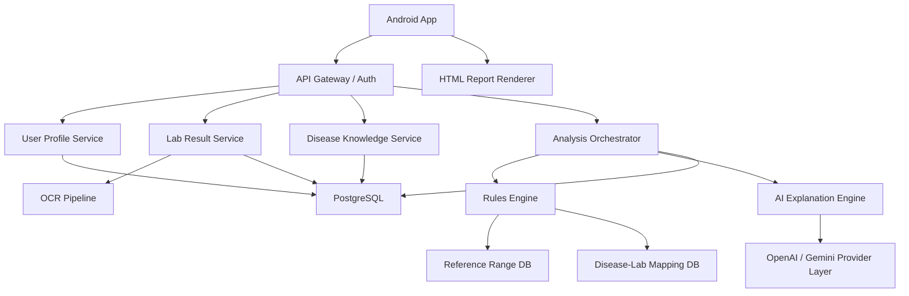

# 시스템 아키텍처 설계

## 1. 아키텍처 원칙
- AI는 "설명 엔진"으로 사용하고, 의학적 기준 비교와 상태 판정은 구조화된 엔진이 담당한다.
- 모바일 앱에 직접 모델 API 키를 노출하지 않는다.
- OCR 결과는 자동 확정하지 않고 사용자 검수 단계를 둔다.
- 의료 해석은 개인 프로필과 질환 컨텍스트를 함께 반영한다.

## 2. 권장 기술 스택
## 2.1 클라이언트
- 프레임워크: `React + Capacitor`
- 이유:
  - HTML 기반 인포그래픽 구현에 유리
  - 애니메이션, 차트, 팝업 UI 설계 자유도 높음
  - Android 앱 패키징 가능

## 2.2 서버
- API 서버: `NestJS`
- 비동기 작업: `BullMQ` 또는 큐 시스템
- 인증: `Firebase Auth` 또는 `Supabase Auth`
- DB: `PostgreSQL`
- 파일 저장: `S3 호환 스토리지`

## 2.3 AI/인식
- OCR:
  - 1차: Google ML Kit 또는 외부 OCR
  - 2차: 서버 정규화 파이프라인
- AI:
  - OpenAI Responses API
  - Gemini API
- 차트/시각화:
  - `ECharts`
  - `Lottie`

## 3. 상위 구성도

## 4. 핵심 모듈
### 4.1 Android App
- 로그인/회원가입
- 프로필 작성
- 검사 결과 업로드/수동 입력
- 리포트 렌더링
- 항목 클릭 팝업
- 기록 조회

### 4.2 User Profile Service
- 사용자 기본 정보 저장
- 일반/환자 모드 관리
- 질환 코드 저장
- 복용약/과거력 관리

### 4.3 Lab Result Service
- OCR 원본 저장
- 항목 정규화
- 검사 회차별 결과 저장
- 항목 단위 상태값 보관

### 4.4 Disease Knowledge Service
- 질환 코드 검색
- 질환-혈액검사 중요도 매핑
- 질환별 주시 포인트 메타데이터 제공

### 4.5 Rules Engine
- 기준치 비교
- 나이/성별/상황별 보정
- 질환/약물 연계 해석용 구조화 데이터 생성
- 위험도 레벨링

### 4.6 AI Explanation Engine
- 구조화된 결과를 쉬운 한국어로 변환
- 전체 요약, 항목별 설명, 질문 추천 생성
- 안전 필터 통과 후 최종 응답 반환

## 5. 데이터 흐름
1. 사용자가 검사표 사진 또는 수동 입력 제출
2. OCR 파이프라인이 텍스트/표 데이터를 추출
3. 정규화 단계에서 항목명을 표준 코드로 매핑
4. 사용자 검수 화면에서 값 확정
5. Rules Engine이 기준치, 질환, 프로필, 약물 맥락을 반영해 구조화 분석 생성
6. AI Engine이 구조화 분석을 바탕으로 설명문 생성
7. 최종 결과를 HTML 인포그래픽 JSON으로 구성
8. 앱에서 대시보드 형태로 렌더링

## 6. 데이터 모델 초안
### 6.1 users
- id
- email
- auth_provider
- created_at

### 6.2 user_profiles
- user_id
- user_type(`general`, `patient`)
- sex
- birth_date
- height
- weight
- medications_json
- histories_json

### 6.3 user_diseases
- id
- user_id
- disease_code
- disease_name
- diagnosis_date
- treatment_status

### 6.4 lab_reports
- id
- user_id
- report_date
- source_type(`photo`, `capture`, `manual`)
- institution_name
- fasting_status
- ocr_status
- analysis_status

### 6.5 lab_results
- id
- report_id
- test_code
- test_name
- value_numeric
- unit
- reference_low
- reference_high
- status_flag

### 6.6 analysis_results
- id
- report_id
- overall_summary
- risk_level
- html_payload
- ai_provider
- model_name

### 6.7 disease_lab_mappings
- id
- disease_code
- test_code
- relevance_score
- clinical_note

## 7. API 초안
### 7.1 인증
- `POST /auth/signup`
- `POST /auth/login`

### 7.2 프로필
- `GET /me`
- `PUT /me/profile`
- `POST /me/diseases`
- `GET /diseases/search?q=`

### 7.3 검사 결과
- `POST /lab-reports`
- `POST /lab-reports/{id}/ocr`
- `PUT /lab-reports/{id}/results`
- `POST /lab-reports/{id}/analyze`
- `GET /lab-reports/{id}`
- `GET /lab-reports/history`

### 7.4 설정
- `PUT /settings/ai-provider`
- `PUT /settings/api-keys`

## 8. 보안 설계
- TLS 강제
- 민감정보 암호화 저장
- API 키는 클라이언트 노출 금지
- 사용자 제공 BYOK 키는 서버 측 암호화 저장
- 접근 로그/감사 로그 저장
- 리포트 공유는 기본 비활성화

## 9. 배포 설계
- Android 앱 배포
- 서버는 컨테이너 기반 배포
- OCR 및 AI 호출은 큐/재시도 구조 적용
- 장애 시 "일부 기능 제한" 모드 지원

## 10. 권장 개발 순서
1. 인증/프로필
2. 질환 검색
3. 수동 입력 기반 리포트 생성
4. 기준치 비교 엔진
5. AI 설명 엔진
6. OCR 도입
7. 추세 분석
8. 고급 디자인/애니메이션
